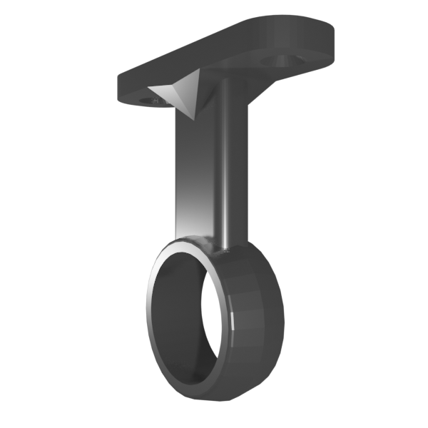

# rail-loop

Loop for suspending coathanger rail inside wardrobes.

* Holes for 4mm diameter countersunk screws
* Support for 19mm diameter coathanger rail

*[.blend](rail-loop.blend), [.stl](rail-loop.stl)*
</h2>