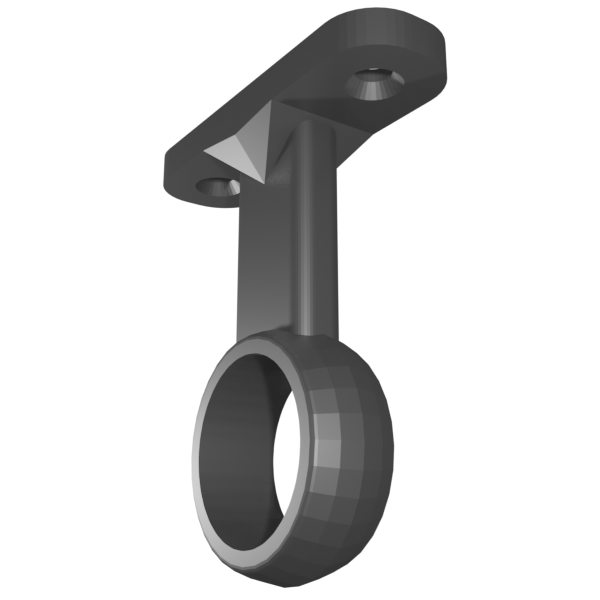

# dish-wand-stand *[.blend](dish-wand-stand.blend), [.stl](dish-wand-stand.stl)*

Stand for parking a dish wand in a split-tub kitchen sink.

# doorbell-cap *[.blend](doorbell-cap.blend), [.stl](doorbell-cap.stl)*

Cap for Mijia wireless switch, with a bell icon imprint.

# ikea-e14-to-e27-bridge *[.scad](ikea-e14-to-e27-bridge.scad), [.stl](ikea-e14-to-e27-bridge.stl)*

Bridge for IKEA's E14 bulb holder to an E27 bulb holder.

# kombucha-filter *[.scad](kombucha-filter.scad), [.stl](kombucha-filter.stl)*

Filter for pouring liquid into bottles with a 17mm diameter mouth

# luminosity-sensor-holder *[.scad](luminosity-sensor-holder.scad), [.stl](luminosity-sensor-holder.stl)*

Monitor-mounted holder for Xiaomi Mijia luminosity sensor.

# rail-loop *[.blend](rail-loop.blend), [.stl](rail-loop.stl)*

Loop for suspending a coathanger rail inside wardrobes.

* Print at 40% infill or higher for best strength
* Holes for 4mm diameter countersunk screws
* Support for 19mm diameter coathanger rail

# rangehood-peg *[.blend](rangehood-peg.blend), [.stl](rangehood-peg.stl)*

Peg to act as a phone or tablet stand.

* Grips the gaps in the rangehood vents
* Print two for best results